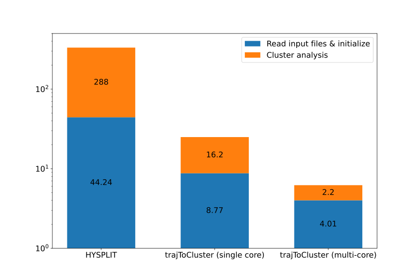

# trajToCluster

trajToCluster: A clustering analysis tool for [HYSPLIT](https://www.ready.noaa.gov/HYSPLIT.php). The software enhances the clustering analysis functionality of HYSPLIT, reducing memory usage and supporting multi-core parallel computation.

|                                                                          | 
|:----------------------------------------------------------------------------------------------------------------:|
| *HYSPLIT, trajToCluster (single-core), trajToCluster (multi-core) run times for clustering analysis (units: s).* |

## Dependences
The code uses some features of C++20. Ensure that your compiler supports C++20. The code uses the `netCDF-cxx` library, the `TBB` parallel algorithm library, and the `cxxopts` command-line argument parsing library. Users can install them using package managers such as vcpkg (Windows), apt (Ubuntu), or Homebrew (macOS). For example, using `vcpkg`:
```shell
vcpkg.exe install netcdf-cxx4:x64-windows
vcpkg.exe install tbb
vcpkg.exe install cxxopts
vcpkg.exe integrate install
```

## Installation
Use `CMake` to build the project.

Windows:
```shell
mkdir build
cmake.exe -DCMAKE_BUILD_TYPE=Release -DCMAKE_TOOLCHAIN_FILE=<vcpkg root directory>\scripts\buildsystems\vcpkg.cmake -S <trajToCluster root directory> -B <trajToCluster root directory>\build
cmake.exe --build <trajToCluster root directory>\build --config Release --target trajToCluster
```
The executable file is located in `build\Release`.

When using other operating systems, you may need to specify the paths of the dependencies using variables like `CMAKE_PREFIX_PATH`. You can also modify the CMakeLists.txt if you prefer a different method for finding packages instead of using `find_package`.

## Usage
Please run `trajToCluster -h` to view the brief documentation.
